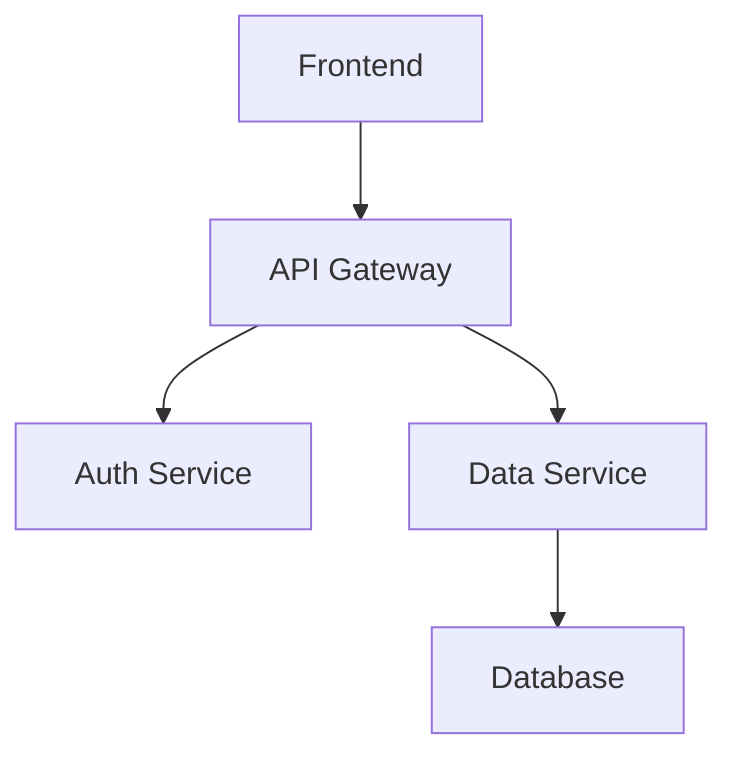

# Design: CodeAtlas Platform

## 1. System Architecture

### 1.1 High-Level Architecture

CodeAtlas follows a three-tier architecture:

```
┌─────────────────────────────────────────────────────────┐
│                     Frontend Layer                       │
│  (React + TypeScript + Vite + TailwindCSS)              │
│  - Repository Input UI                                   │
│  - Visualization Dashboard                               │
│  - Search Interface                                      │
│  - Quality Metrics Display                               │
└─────────────────────────────────────────────────────────┘
                          │
                    REST API (HTTP/JSON)
                          │
┌─────────────────────────────────────────────────────────┐
│                     Backend Layer                        │
│              (Node.js + Express.js)                      │
│  - API Gateway                                           │
│  - Repository Service                                    │
│  - Analysis Service                                      │
│  - Search Service                                        │
│  - Visualization Service                                 │
└─────────────────────────────────────────────────────────┘
                          │
              ┌───────────┴───────────┐
              │                       │
┌─────────────▼─────────┐  ┌─────────▼──────────┐
│   Analysis Engine     │  │   Data Layer       │
│  - AST Parser         │  │  - Vector DB       │
│  - Dependency Tracker │  │  - Metadata Store  │
│  - Complexity Analyzer│  │  - File Cache      │
│  - Embedding Generator│  │                    │
└───────────────────────┘  └────────────────────┘
```

### 1.2 Component Breakdown

#### Frontend Components
- **RepositoryInputView**: URL input and repository submission
- **DashboardView**: Main visualization and navigation hub
- **ArchitectureDiagramView**: Interactive architecture diagrams
- **DependencyGraphView**: Module and class dependency visualization
- **SearchView**: Semantic search interface
- **QualityMetricsView**: Code quality insights and hotspots
- **DocumentationView**: Auto-generated documentation display

#### Backend Services
- **RepositoryService**: GitHub integration, cloning, and repo management
- **AnalysisService**: Orchestrates code analysis pipeline
- **SearchService**: Handles semantic search queries
- **VisualizationService**: Generates diagram data
- **QualityService**: Computes code quality metrics

#### Analysis Engine
- **ASTParser**: Parses source files into abstract syntax trees
- **DependencyExtractor**: Identifies and maps dependencies
- **ComplexityAnalyzer**: Calculates cyclomatic complexity
- **EmbeddingGenerator**: Creates vector embeddings for code
- **LanguageDetector**: Identifies programming languages

## 2. Data Models

### 2.1 Repository Model
```typescript
interface Repository {
  id: string;
  url: string;
  name: string;
  owner: string;
  branch: string;
  clonedAt: Date;
  analyzedAt: Date;
  status: 'pending' | 'analyzing' | 'completed' | 'failed';
  metadata: {
    languages: string[];
    fileCount: number;
    totalLines: number;
  };
}
```

### 2.2 Module Model
```typescript
interface Module {
  id: string;
  repositoryId: string;
  path: string;
  name: string;
  type: 'file' | 'directory' | 'package';
  language: string;
  dependencies: string[]; // Module IDs
  exports: Export[];
  imports: Import[];
  complexity: number;
  lines: number;
}
```

### 2.3 Code Entity Model
```typescript
interface CodeEntity {
  id: string;
  moduleId: string;
  type: 'class' | 'function' | 'interface' | 'enum' | 'variable';
  name: string;
  signature: string;
  startLine: number;
  endLine: number;
  complexity: number;
  dependencies: string[]; // Entity IDs
  embedding: number[]; // Vector embedding
}
```

### 2.4 Dependency Model
```typescript
interface Dependency {
  id: string;
  sourceId: string;
  targetId: string;
  type: 'import' | 'call' | 'inheritance' | 'composition';
  strength: number; // Usage frequency
}
```

### 2.5 Quality Metric Model
```typescript
interface QualityMetric {
  entityId: string;
  complexity: number;
  maintainabilityIndex: number;
  cognitiveComplexity: number;
  linesOfCode: number;
  riskLevel: 'low' | 'medium' | 'high';
}
```

## 3. API Design

### 3.1 Repository Endpoints

```
POST /api/repositories
Body: { url: string, branch?: string, token?: string }
Response: { repositoryId: string, status: string }
```

```
GET /api/repositories/:id
Response: Repository
```

```
GET /api/repositories/:id/status
Response: { status: string, progress: number, message: string }
```

### 3.2 Analysis Endpoints

```
GET /api/repositories/:id/modules
Response: Module[]
```

```
GET /api/repositories/:id/entities
Query: { type?: string, moduleId?: string }
Response: CodeEntity[]
```

```
GET /api/repositories/:id/dependencies
Response: Dependency[]
```

### 3.3 Search Endpoints

```
POST /api/search/semantic
Body: { repositoryId: string, query: string, limit?: number }
Response: { results: SearchResult[], took: number }
```

```
GET /api/search/entity/:id/related
Response: CodeEntity[]
```

### 3.4 Visualization Endpoints

```
GET /api/repositories/:id/diagrams/architecture
Response: { mermaid: string, metadata: object }
```

```
GET /api/repositories/:id/diagrams/dependencies
Query: { moduleId?: string, depth?: number }
Response: { nodes: Node[], edges: Edge[] }
```

### 3.5 Quality Endpoints

```
GET /api/repositories/:id/quality/metrics
Response: QualityMetric[]
```

```
GET /api/repositories/:id/quality/hotspots
Response: { entities: CodeEntity[], metrics: QualityMetric[] }
```

## 4. Analysis Pipeline

### 4.1 Pipeline Stages

```
Repository URL
    ↓
[1] Clone Repository (GitHub API)
    ↓
[2] Detect Languages & Structure
    ↓
[3] Parse Files → AST
    ↓
[4] Extract Entities (classes, functions, etc.)
    ↓
[5] Extract Dependencies
    ↓
[6] Calculate Complexity Metrics
    ↓
[7] Generate Embeddings
    ↓
[8] Index to Vector Database
    ↓
[9] Generate Visualizations
    ↓
Complete
```

### 4.2 Stage Details

#### Stage 1: Clone Repository
- Use GitHub API to clone repository
- Handle authentication for private repos
- Store in temporary file system
- Track clone status

#### Stage 2: Language Detection
- Scan file extensions
- Identify primary and secondary languages
- Determine appropriate parsers

#### Stage 3: AST Parsing
- Parse each source file using language-specific parser
- Handle parse errors gracefully
- Extract structural information

#### Stage 4: Entity Extraction
- Identify classes, functions, interfaces, etc.
- Extract signatures and metadata
- Determine entity relationships

#### Stage 5: Dependency Extraction
- Map imports and exports
- Track function calls
- Identify inheritance and composition
- Build dependency graph

#### Stage 6: Complexity Analysis
- Calculate cyclomatic complexity
- Compute cognitive complexity
- Determine maintainability index
- Identify risk areas

#### Stage 7: Embedding Generation
- Generate vector embeddings for entities
- Use code-specific embedding model
- Normalize vectors

#### Stage 8: Vector Database Indexing
- Store embeddings in vector database
- Index for fast retrieval
- Link to entity metadata

#### Stage 9: Visualization Generation
- Generate Mermaid diagram definitions
- Create graph data structures
- Prepare UI-ready data

## 5. Technology Stack Details

### 5.1 Frontend Stack

**Core Framework**
- React 18+ with TypeScript
- Vite for build and dev server
- React Router for navigation

**Styling**
- TailwindCSS for utility-first styling
- CSS Modules for component-specific styles

**Visualization Libraries**
- D3.js for custom graph rendering
- React Flow for interactive node graphs
- Mermaid for diagram generation
- Recharts for metrics visualization

**State Management**
- React Context for global state
- TanStack Query for server state
- Zustand for client state (if needed)

**UI Components**
- Headless UI for accessible components
- Radix UI for complex interactions
- Custom components for domain-specific needs

### 5.2 Backend Stack

**Runtime & Framework**
- Node.js 18+ LTS
- Express.js for REST API
- TypeScript for type safety

**Code Analysis**
- @babel/parser for JavaScript/TypeScript
- tree-sitter for multi-language parsing
- acorn for lightweight JS parsing
- esprima as fallback parser

**Dependency Analysis**
- madge for dependency graphs
- dependency-cruiser for validation
- Custom extractors for specific languages

**Complexity Analysis**
- escomplex for JavaScript complexity
- Custom complexity calculators

### 5.3 AI & Search Stack

**Embedding Generation**
- Sentence Transformers (Python service)
- CodeBERT or GraphCodeBERT models
- REST API wrapper for Node.js integration

**Vector Database**
- Pinecone for managed vector search
- Alternative: Weaviate or Qdrant
- Fallback: FAISS with local storage

**Search Engine**
- Vector similarity search
- Hybrid search (vector + keyword)
- Result ranking and filtering

### 5.4 Data Storage

**Primary Storage**
- PostgreSQL for metadata
- Redis for caching
- File system for cloned repos

**Schema**
- Repositories table
- Modules table
- Entities table
- Dependencies table
- Quality metrics table

### 5.5 Infrastructure

**Deployment**
- Docker containers
- Docker Compose for local dev
- Cloud deployment (AWS/GCP/Azure)

**Repository Management**
- Temporary file storage
- Cleanup jobs for old repos
- Git operations via nodegit or simple-git

## 6. Visualization Strategy

### 6.1 Architecture Diagram

**Type**: Mermaid flowchart
**Shows**: High-level module structure
**Interactions**: Click to zoom, hover for details



### 6.2 Dependency Graph

**Type**: Force-directed graph (D3.js)
**Shows**: Module dependencies
**Interactions**: Drag nodes, filter by type, adjust depth

**Node Properties**:
- Size: Lines of code
- Color: Complexity level
- Shape: Module type

**Edge Properties**:
- Thickness: Dependency strength
- Color: Dependency type

### 6.3 Call Graph

**Type**: Hierarchical tree (React Flow)
**Shows**: Function call relationships
**Interactions**: Expand/collapse, search, highlight paths

### 6.4 Sequence Diagram

**Type**: Mermaid sequence diagram
**Shows**: Request flow through system
**Interactions**: Step through execution

### 6.5 Heatmap

**Type**: Treemap (Recharts)
**Shows**: Complexity distribution
**Interactions**: Drill down, filter, compare

## 7. Search Implementation

### 7.1 Semantic Search Flow

```
User Query
    ↓
[1] Embed Query (same model as code)
    ↓
[2] Vector Similarity Search
    ↓
[3] Retrieve Top K Results
    ↓
[4] Re-rank by Relevance
    ↓
[5] Enrich with Metadata
    ↓
Display Results
```

### 7.2 Search Features

**Query Types**:
- Natural language: "authentication logic"
- Code snippets: "function that validates email"
- Concept-based: "error handling patterns"

**Filters**:
- Entity type (class, function, etc.)
- Module/file
- Complexity range
- Language

**Result Display**:
- Code snippet with context
- File path and line numbers
- Complexity metrics
- Related entities
- Jump to visualization

### 7.3 Related Component Discovery

**Algorithm**:
1. Get entity embedding
2. Find K nearest neighbors in vector space
3. Filter by dependency relationships
4. Rank by combined score (similarity + dependency strength)
5. Return top N results

## 8. Quality Analysis

### 8.1 Complexity Metrics

**Cyclomatic Complexity**:
- Count decision points in code
- Threshold: >10 is high complexity

**Cognitive Complexity**:
- Measure code understandability
- Account for nesting and control flow

**Maintainability Index**:
- Composite metric (0-100)
- Based on complexity, volume, and comments

### 8.2 Hotspot Detection

**Criteria**:
- High complexity (>15)
- Large size (>200 lines)
- Many dependencies (>10)
- Frequent changes (if git history available)

**Risk Levels**:
- Low: 0-1 criteria met
- Medium: 2 criteria met
- High: 3+ criteria met

### 8.3 Visualization

**Heatmap**: Color-code files by complexity
**List View**: Sortable table of metrics
**Trend View**: Complexity over time (future)

## 9. Performance Optimization

### 9.1 Analysis Performance

**Strategies**:
- Parallel file parsing
- Incremental analysis (cache results)
- Skip non-code files
- Limit analysis depth for large repos

**Targets**:
- Small repos (<100 files): <1 minute
- Medium repos (100-1000 files): 2-5 minutes
- Large repos (>1000 files): 5-15 minutes

### 9.2 Search Performance

**Strategies**:
- Vector index optimization
- Result caching
- Pagination
- Lazy loading

**Targets**:
- Query response: <2 seconds
- Vector search: <500ms
- Result enrichment: <1 second

### 9.3 UI Performance

**Strategies**:
- Virtual scrolling for large lists
- Progressive rendering for graphs
- Web workers for heavy computation
- Debounced search input
- Optimistic UI updates

**Targets**:
- Initial load: <3 seconds
- Interaction response: <100ms
- Graph rendering: <2 seconds

### 9.4 Caching Strategy

**Levels**:
1. Browser cache (static assets)
2. Redis cache (API responses)
3. Vector DB cache (search results)
4. File system cache (parsed ASTs)

**TTL**:
- Repository metadata: 1 hour
- Analysis results: 24 hours
- Search results: 15 minutes
- Diagrams: 1 hour

## 10. Security Considerations

### 10.1 Authentication

**GitHub OAuth**:
- Use OAuth flow for private repos
- Store tokens securely (encrypted)
- Refresh tokens automatically
- Revoke on logout

### 10.2 Authorization

**Access Control**:
- Users can only access their analyzed repos
- Private repo data is isolated
- Admin role for system management

### 10.3 Data Protection

**Strategies**:
- Encrypt sensitive data at rest
- Use HTTPS for all communication
- Sanitize user inputs
- Rate limiting on API endpoints
- CORS configuration

### 10.4 Repository Security

**Measures**:
- Isolated file system per user
- Automatic cleanup of cloned repos
- No execution of cloned code
- Scan for malicious patterns

## 11. Error Handling

### 11.1 Analysis Errors

**Scenarios**:
- Repository not found
- Authentication failure
- Parse errors
- Unsupported language
- Timeout

**Handling**:
- Graceful degradation
- Partial results when possible
- Clear error messages
- Retry mechanisms
- Fallback parsers

### 11.2 Search Errors

**Scenarios**:
- Vector DB unavailable
- Query timeout
- No results found

**Handling**:
- Fallback to keyword search
- Cached results
- User-friendly messages

### 11.3 UI Error Handling

**Strategies**:
- Error boundaries
- Toast notifications
- Retry buttons
- Fallback UI states
- Loading skeletons

## 12. Testing Strategy

### 12.1 Unit Tests

**Coverage**:
- Parser functions
- Dependency extraction
- Complexity calculations
- API endpoints
- React components

**Framework**: Jest + React Testing Library

### 12.2 Integration Tests

**Coverage**:
- Analysis pipeline end-to-end
- API workflows
- Database operations
- Vector search

**Framework**: Jest + Supertest

### 12.3 E2E Tests

**Coverage**:
- Repository submission flow
- Visualization interactions
- Search functionality
- Navigation

**Framework**: Playwright or Cypress

### 12.4 Performance Tests

**Coverage**:
- Analysis speed benchmarks
- Search latency
- UI rendering performance
- Concurrent user load

**Tools**: k6, Lighthouse

## 13. Deployment Architecture

### 13.1 Development Environment

```
Docker Compose:
- Frontend (Vite dev server)
- Backend (Node.js with nodemon)
- PostgreSQL
- Redis
- Vector DB (local instance)
```

### 13.2 Production Environment

```
Cloud Infrastructure:
- Frontend: CDN (Vercel/Netlify) or S3 + CloudFront
- Backend: Container service (ECS/Cloud Run/App Service)
- Database: Managed PostgreSQL (RDS/Cloud SQL)
- Cache: Managed Redis (ElastiCache/MemoryStore)
- Vector DB: Pinecone (managed) or self-hosted
- Storage: S3/Cloud Storage for repos
```

### 13.3 CI/CD Pipeline

**Stages**:
1. Lint and format check
2. Unit tests
3. Integration tests
4. Build artifacts
5. Deploy to staging
6. E2E tests
7. Deploy to production

**Tools**: GitHub Actions or GitLab CI

## 14. Monitoring & Observability

### 14.1 Metrics

**Application Metrics**:
- Analysis completion rate
- Average analysis time
- Search query latency
- API response times
- Error rates

**Infrastructure Metrics**:
- CPU and memory usage
- Database connections
- Cache hit rates
- Vector DB performance

### 14.2 Logging

**Levels**:
- Error: Failures and exceptions
- Warn: Degraded performance
- Info: Key operations
- Debug: Detailed flow (dev only)

**Structure**: JSON logs with correlation IDs

### 14.3 Alerting

**Alerts**:
- High error rate
- Slow analysis times
- Database connection issues
- High memory usage
- Vector DB unavailable

**Channels**: Email, Slack, PagerDuty

## 15. Scalability Considerations

### 15.1 Horizontal Scaling

**Stateless Services**:
- Multiple backend instances
- Load balancer distribution
- Session management via Redis

### 15.2 Database Scaling

**Strategies**:
- Read replicas for queries
- Connection pooling
- Query optimization
- Partitioning by repository

### 15.3 Analysis Scaling

**Strategies**:
- Queue-based processing
- Worker pool for parallel analysis
- Distributed task execution
- Priority queuing

### 15.4 Storage Scaling

**Strategies**:
- Object storage for repos
- CDN for static assets
- Cleanup policies
- Compression

## 16. Future Enhancements

### 16.1 Real-time Collaboration

**Features**:
- Shared viewing sessions
- Annotations and comments
- Live cursors
- Chat integration

**Technology**: WebSockets, operational transforms

### 16.2 IDE Integration

**VS Code Extension**:
- In-editor visualization
- Quick navigation
- Inline metrics
- Search integration

**Implementation**: VS Code Extension API

### 16.3 Multi-Repository Analysis

**Features**:
- Cross-repo dependencies
- Microservice architecture view
- Shared component detection

**Challenges**: Scale, data model, visualization

### 16.4 AI-Powered Features

**Capabilities**:
- Refactoring suggestions
- Code smell detection
- Architecture recommendations
- Documentation generation

**Technology**: LLMs, fine-tuned models

## 17. Correctness Properties

### 17.1 Analysis Correctness

**Property 1.1**: Dependency Completeness
- For any module M, all imports in M's source code must appear in M's dependency list
- **Validates: Requirements 3.2**

**Property 1.2**: Dependency Accuracy
- For any dependency D from module A to module B, module B must exist in the repository
- **Validates: Requirements 3.2**

**Property 1.3**: Entity Extraction Completeness
- For any class/function declaration in source code, a corresponding entity must exist in the analysis results
- **Validates: Requirements 3.2**

**Property 1.4**: Complexity Monotonicity
- Adding conditional branches to a function must not decrease its cyclomatic complexity
- **Validates: Requirements 3.5**

### 17.2 Search Correctness

**Property 2.1**: Search Consistency
- Searching for the same query twice should return the same results (given no repository changes)
- **Validates: Requirements 3.4**

**Property 2.2**: Embedding Determinism
- Generating embeddings for the same code twice should produce identical vectors
- **Validates: Requirements 3.4**

**Property 2.3**: Relevance Ordering
- Search results must be ordered by relevance score in descending order
- **Validates: Requirements 3.4**

### 17.3 Visualization Correctness

**Property 3.1**: Graph Connectivity
- In a dependency graph, every edge must connect two existing nodes
- **Validates: Requirements 3.3**

**Property 3.2**: Diagram Completeness
- All modules in the repository must appear in the architecture diagram
- **Validates: Requirements 3.3**

**Property 3.3**: Cycle Detection
- If a circular dependency exists in code, it must be detectable in the dependency graph
- **Validates: Requirements 3.3**

### 17.4 Data Integrity

**Property 4.1**: Referential Integrity
- Every entity must reference a valid module, and every module must reference a valid repository
- **Validates: Requirements 3.2**

**Property 4.2**: Metric Bounds
- Complexity metrics must be non-negative integers
- **Validates: Requirements 3.5**

**Property 4.3**: Idempotent Analysis
- Analyzing the same repository twice should produce equivalent results
- **Validates: Requirements 3.2**

### 17.5 API Correctness

**Property 5.1**: Status Consistency
- A repository's status must progress through valid state transitions only (pending → analyzing → completed/failed)
- **Validates: Requirements 3.1**

**Property 5.2**: Response Completeness
- API responses must include all required fields as defined in the data models
- **Validates: Requirements 3.8**

## 18. Testing Framework

**Property-Based Testing Library**: fast-check (JavaScript/TypeScript)

**Test Structure**:
```typescript
import fc from 'fast-check';

describe('Property: Dependency Completeness', () => {
  it('all imports must appear in dependency list', () => {
    fc.assert(
      fc.property(
        arbitrarySourceCode(),
        (sourceCode) => {
          const imports = extractImports(sourceCode);
          const analysis = analyzeModule(sourceCode);
          return imports.every(imp => 
            analysis.dependencies.includes(imp)
          );
        }
      )
    );
  });
});
```

## 19. Implementation Phases

### Phase 1: Core Infrastructure (MVP)
- Basic repository cloning
- Simple AST parsing (JavaScript/TypeScript only)
- Dependency extraction
- Basic visualization (module graph)
- Simple UI

### Phase 2: Enhanced Analysis
- Multi-language support
- Complexity metrics
- Quality analysis
- Improved visualizations

### Phase 3: Search & AI
- Embedding generation
- Vector database integration
- Semantic search
- Related component discovery

### Phase 4: Polish & Scale
- Performance optimization
- Advanced visualizations
- Documentation generation
- Production deployment

### Phase 5: Advanced Features
- Real-time collaboration
- IDE integration
- Multi-repository support
- AI-powered insights
